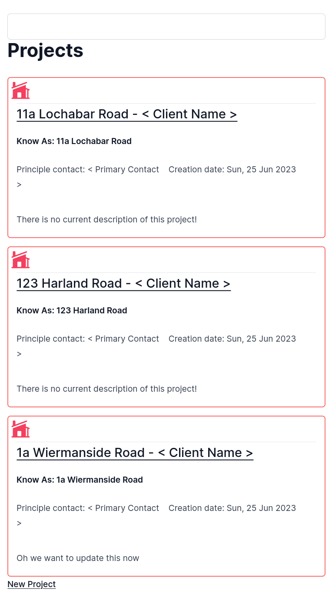
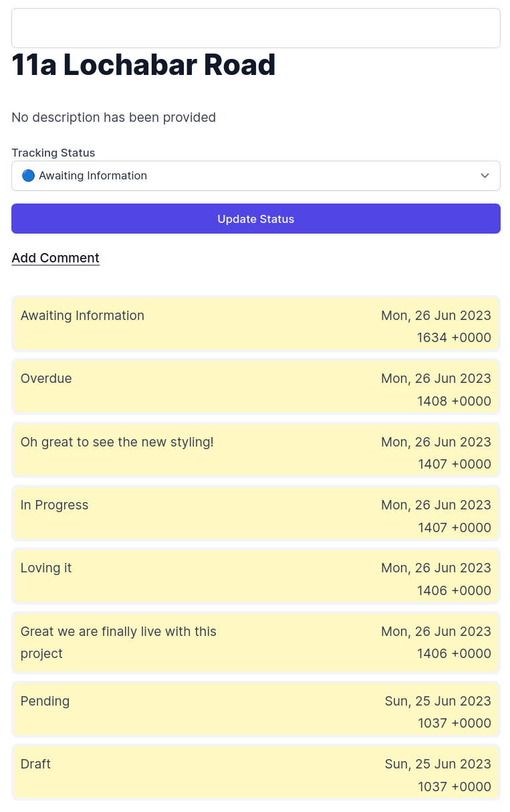
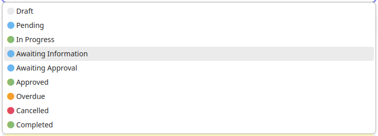

# SCREENSHOTS

**Contents:**
- [Overview](#overview)
- [Projects view](#projects-view)
- [Project view](#project-view)

# Overview

This is where we keep the approved designs that the development team are working too, and screenshots of screens developed for sharing with business/project/design colleagues at each sprint design review session (Tuesdays, 1400).

# Projects view

The main window onto all the projects we run for various clients. From here one can select a project of interest to dig into that more. In addition one can create new client projects by using the link `New Project`

# Project view

The project view contains details about an individual client project.
Currently the `tracking status` of the project can be found and alterted from this view.
In addition the comments that are created are presented here in the `history aggregation` section, by default they are ordered most recent to least recent.

Included is the current version of the options selector for Tracking Statuses.
The coloured circles are as close as we can get to the styles presented and used elsewhere
in the application. They are circle emojis embedded via the editor.

